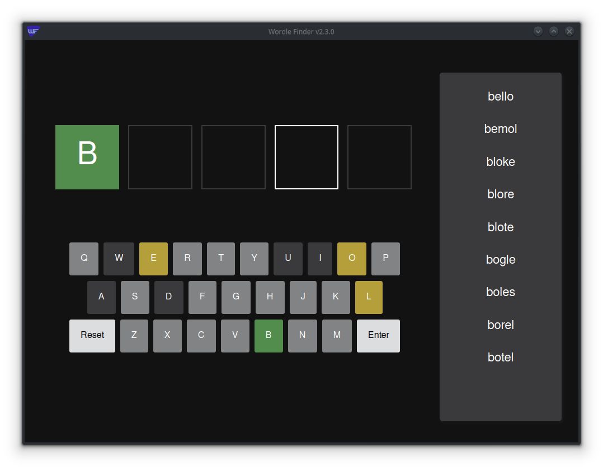

# Wordle Finder
Rust program to help find the wordle word

## Use
This program can be used from a terminal, run `./wordle_finder --help` for more info. If you'd like to use the GUI frontend, you can launch it by running `./wordle_finder -g` in a terminal or opening the binary from a file explorer.

## Downloading
I provide pre-built binaries on the releases page. I do not test the Windows binary, but it may work.

### Windows Users
If you launch the program by double clicking and it immediately closes, or you get an error similar to this: `thread 'main' panicked at 'Error when running GUI: WebView2Error(WindowsError(Error { code: 0x80070002, message: The system cannot find the file specified., win32_error: 2 }))'`, then you should try installing the WebView2 Runtime from the [Microsoft website](https://developer.microsoft.com/en-us/microsoft-edge/webview2/#download-section).

## Building
First, install rust using your package manager or from https://www.rust-lang.org/.

#### Linux systems with make
Linux systems with make installed can make the project that way `make linux` or `make windows-x64` will make the respective binaries and output them in the `dist/` folder.

#### Other systems
Other systems can build the binary for their system by running `cargo build --release` in the repository folder. The resulting binary can be found at `./target/release/wordle_finder` or `./target/release/wordle_finder.exe` if you're on Windows.
